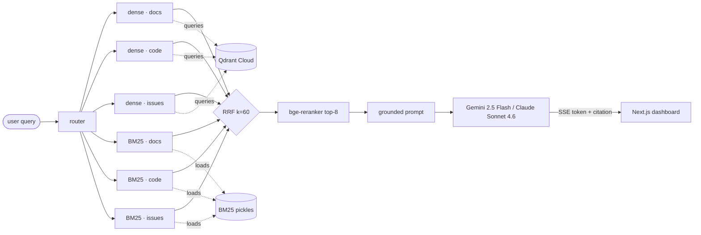

<div align="center">

# Torch

**Grounded PyTorch help. Cited from source.**

A retrieval-augmented support engineer for PyTorch — hybrid retrieval over docs, source code, and GitHub issues, with inline click-through citations and a measured retrieval/answer-quality dashboard.

[Repo](https://github.com/akshttdev/Torch) · [Architecture](#architecture) · [Corpora](#corpora) · [Storage](#storage-architecture) · [Retrieval](#retrieval-pipeline) · [Quickstart](#quickstart) · [Stack](#tech-stack)


</div>

---

## Why this exists

A general LLM will happily invent a `torch.nn.Linear` argument that doesn't exist. The cost is real: a hallucinated method call burns 30 minutes of debugging and an embarrassing pull request.

**Torch refuses, or it shows you the exact line of `torch/nn/modules/linear.py` that proves the claim.** Every answer streams over SSE; every `[n]` token in the answer maps to a clickable chunk with its source URL, similarity score, and snippet preview. If retrieval comes back empty, the answer is *"I couldn't find any grounded sources for that question"* — not a confident guess.

The retrieval pipeline is **measurable**. A 250-question benchmark covers `Hit@k`, `MRR`, faithfulness, citation precision, and `p50/p95/p99` latency, surfaced on the dashboard at `/dashboard/eval`.

---

## Architecture



A query travels in seven steps:

1. **Router** (`backend/app/rag/router.py`) scores the question against per-source keyword vocabularies, picks the collections to hit (`docs`, `code`, `issues`), and assigns a routing weight per source.
2. **Retrieval (parallel)** — each collection is queried twice, concurrently:
   - **Dense**: `BAAI/bge-base-en-v1.5` (docs + issues) or a mean-pooled `microsoft/codebert-base` (code), top-50 from Qdrant.
   - **BM25**: per-collection `rank_bm25` index loaded from a pickle, top-50.
3. **Fusion** — [Reciprocal Rank Fusion](https://plg.uwaterloo.ca/~gvcormac/cormacksigir09-rrf.pdf) (`k=60`) combines all six rank lists without score normalization. Top-30 survives.
4. **Rerank** — `BAAI/bge-reranker-base` cross-encoder reorders the top-30 to a final top-8.
5. **Prompt** — those 8 chunks are numbered `1..8` and pasted into a grounded-answer prompt that requires `[n]` markers after every factual claim.
6. **Stream** — the LLM streams the answer over SSE. A regex (`/\[(\d+)\]/g`) running over the token stream intercepts each `[n]` and emits a separate `citation` event mapping `n` → chunk metadata.
7. **Render** — `/dashboard/q/[id]` paints tokens into a prose container; citations resolve into right-rail cards with hover preview and click-through to the exact line on GitHub or anchor on pytorch.org.

---

## Corpora

Three independent corpora, each indexed with its own chunker and embedder. All three share one Qdrant payload shape (`kind`, `source_url`, `title`, `content`, `anchor`, `last_synced_at`, `sha`).

### Docs — `pytorch.org/docs/stable`

The Sphinx-rendered API reference and conceptual notes.

| Stage | Component | Detail |
|---|---|---|
| Discover | `crawler.get_doc_links()` | Resolves the `stable` redirect stub → actual versioned root (e.g. `/docs/2.12/`). Seeds from `genindex.html`, `index.html`, `py-modindex.html`. Yields ~2 800 unique page URLs. |
| Crawl | `crawler.extract_page()` via `ThreadPoolExecutor(16)` | Pulls each page in parallel, isolates the `<article class="bd-article">` body, strips `.toctree-wrapper` nav. ~3 min wall time. |
| Chunk | `chunker.chunk_docs()` | Section-aware split anchored on `<h1/h2/h3>` headings with code-block preservation. ~4–8k chunks total. |
| Embed | `BAAI/bge-base-en-v1.5` | 768-d, COSINE. Mean of CLS + mean-pool. ~75 chunks/sec on RTX 2060. |
| Store | Qdrant collection `torch_docs` + B2 `docs/latest.jsonl.gz` | Dual-write — see [Storage](#storage-architecture). |

### Code — `pytorch/pytorch` source

The actual PyTorch Python implementation — `torch/`, excluding tests, third-party, and tooling.

| Stage | Component | Detail |
|---|---|---|
| Walk | `code_parser.walk()` | `Path("data/pytorch").rglob("*.py")`, filtered to `torch/**`. ~550 files. |
| Parse | `code_parser.CodeChunkExtractor` (AST) | One chunk per top-level `FunctionDef` / `ClassDef`. Each carries the symbol name as `title`, docstring + body as `content`, file path as `source_url`, line number as `anchor`. ~18k chunks. |
| Embed | `microsoft/codebert-base` (mean-pooled into a sentence encoder by `sentence-transformers`) | 768-d, COSINE. ~240 chunks/sec on RTX 2060. |
| Store | Qdrant collection `torch_code` + B2 `code/latest.jsonl.gz` | |

### Issues — `pytorch/pytorch` GitHub

Active discussion threads from the last 12 months. Captures the real-world failure modes that don't appear in either docs or source.

| Stage | Component | Detail |
|---|---|---|
| Fetch | PyGithub paginator (`per_page=100`) | Lazy proxies for the top-N issues by `created_at`. |
| Hydrate | `ThreadPoolExecutor(16)` | Pulls body + first 5 comments per issue concurrently. Caps at 5 comments to skip bot replies and `+1` noise. ~3 min for 1 500 issues. |
| Chunk | `chunker.chunk_issue()` | Title + body as one chunk, each substantive comment as its own chunk. ~4 chunks per issue. |
| Embed | `BAAI/bge-base-en-v1.5` | 768-d, COSINE. Same encoder as docs — issues are prose. |
| Store | Qdrant collection `torch_issues` + B2 `issues/latest.jsonl.gz` | |

---

## Storage architecture

**Two stores, one source of truth.** Qdrant is the runtime index; Backblaze B2 is the durable backup.

```
Backblaze B2 (S3-compatible)                Qdrant Cloud
─────────────────────────────               ─────────────────────────────
<bucket>/                                   cluster/
  docs/                                       media           (Synapse, untouched)
    chunks/<ts>.jsonl.gz   ← versioned        torch_docs      (created on first upsert)
    latest.jsonl.gz        ← pointer          torch_code
  code/                                       torch_issues
    chunks/<ts>.jsonl.gz
    latest.jsonl.gz
  issues/
    chunks/<ts>.jsonl.gz
    latest.jsonl.gz
  bm25/
    docs.pkl       ┐
    code.pkl       ├─ pickled rank_bm25 indexes — fetched on FastAPI boot
    issues.pkl     ┘
```

**Why dual-write:**

- **Qdrant free tier can be reclaimed** after long inactivity. Re-embedding 25k chunks from scratch is 30 min; restoring from B2 is 2 min because vectors are pre-baked into the JSONL.
- **B2 batches are timestamped + immutable.** `latest.jsonl.gz` is a thin pointer that's atomically overwritten on each batch. Lossless rollback to any prior snapshot.
- **Shared Qdrant cluster.** All `torch_*` collections live next to other projects' collections on the same cluster. Namespacing comes from `TORCH_COLLECTION_PREFIX` (default `torch_`), so collisions are impossible.

**Restore in one command.** If Qdrant ever wipes:

```bash
python -m app.scripts.restore_from_b2 --all
# rebuilds torch_docs, torch_code, torch_issues in ~2 min
# (vectors already in JSONL — no re-embed pass needed)
```

---

## Retrieval pipeline

Hybrid scoring keeps both lexical and semantic signals. Pure dense misses literal symbols like `optimizer.zero_grad(set_to_none=True)`; pure sparse misses paraphrase. RRF fuses the two without needing score normalization across embedders.

| Stage | Module | Behaviour |
|---|---|---|
| Routing | `app/rag/router.py` | Keyword overlap scoring per source vocabulary picks which corpora to query and at what weight. Multi-corpus by default. |
| Dense | `app/retrieval/hybrid.py:_dense_search` | `qdrant.query_points` with the query embedding from BGE (text) or CodeBERT (code), top-50. |
| Sparse | `app/retrieval/hybrid.py:_bm25_search` | `rank_bm25.get_scores`, top-50. Tokenizer is dotted-identifier-aware so `torch.nn.Linear` and `set_to_none` stay intact. |
| Fusion | `app/rag/fusion.py:reciprocal_rank_fusion` | True RRF, `score(d) = Σ_lists 1 / (k + rank_list(d))` with `k=60`. Returns top-30. |
| Rerank | `BAAI/bge-reranker-base` cross-encoder | Reorders the top-30 to a final top-8. ~70 ms on CPU. |

The `/search` endpoint exposes the pipeline directly (returns ranked chunks with scores). `/ask` wraps the same pipeline with prompt assembly + LLM streaming.

---

## LLM layer

| Concern | Choice | Rationale |
|---|---|---|
| Provider | Gemini 2.5 Flash (default), Anthropic Claude Sonnet 4.6 (alternative) | Both stream and follow citation contracts cleanly. Provider toggled via `LLM_PROVIDER` env. |
| Citation contract | `[n]` inline markers required after every factual claim | Token-stream regex `/\[(\d+)\]/g` extracts citations as they arrive; UI swaps each `[n]` for a pastel chip that scrolls the matching right-rail card into focus. |
| Streaming wire | Server-Sent Events over POST | Native `EventSource` is GET-only, so the frontend uses `fetch` + `ReadableStream` + manual SSE parsing in `frontend/lib/api.ts`. |
| Backoff | "I couldn't find grounded sources" | If routing → retrieval → rerank yields zero, the LLM is bypassed entirely. No confident guesses. |

Event shape on the wire:

```
data: {"type":"sources","sources":[{"n":1,"id":"…","kind":"code","title":"torch.no_grad","url":"…","score":0.83,"snippet":"…"}, …]}
data: {"type":"token","text":"To "}
data: {"type":"token","text":"disable "}
…
data: {"type":"citation","id":1,"source":{…}}
…
data: {"type":"done","latency_ms":1820,"n_tokens":612}
```

---

## Frontend

`frontend/` is a Next.js 15 App Router project. Two display fonts on purpose — editorial serif on marketing surfaces, technical mono on the tool.

| Route | Purpose |
|---|---|
| `/` | Landing — hero (chat preview) → features → impact → pipeline + docs → FAQ → CTA → footer |
| `/dashboard` | Overview — greeting, stat cards, activity feed, system row |
| `/dashboard/ask` | Omnibox — filter pills, sample prompts, history |
| `/dashboard/q/[id]` | Live answer — streamed tokens, inline `[n]` chips, right-rail citation cards |
| `/dashboard/q` | Local history (no server persistence) |
| `/dashboard/sources` | Per-corpus tables — live counts pulled from `/sources`, payload schema, chunker config |
| `/dashboard/eval` | Eval metric grid — Hit@k, MRR, faithfulness, citation precision, latency |
| `/terms` | Terms & conditions |

All client → backend calls go through `frontend/lib/api.ts`. Set `NEXT_PUBLIC_API_URL` in Vercel to the public host fronting your FastAPI deployment.

---

## Tech stack

| Layer | Tech | Why |
|---|---|---|
| Frontend | Next.js 15 (App Router), TypeScript, Tailwind 3, Framer Motion, Lenis | RSC + native SSE consumer; clean primitives, no UI-library bloat |
| Fonts | Instrument Serif (landing) + Geist Mono (dashboard) + Geist Sans (body) | Editorial vs technical surfaces, distinct without trendy |
| Backend | FastAPI, `sse-starlette`, Pydantic v2 | Async, native SSE, no flask gymnastics |
| Vector DB | Qdrant Cloud (768-d, COSINE) | Hybrid-friendly, free-tier covers v1 corpus, deterministic UUIDs |
| Durable store | Backblaze B2 (S3-compatible API) | Cheap object storage; `boto3` reuses standard AWS creds |
| Text embedder | `BAAI/bge-base-en-v1.5` | Strong, free, on-disk repeatable for eval |
| Code embedder | `microsoft/codebert-base` (mean-pooled) | Sentence-transformers wraps as a sentence encoder via automatic mean-pooling |
| Sparse retrieval | `rank_bm25` per collection, pickled to `data/bm25/*.pkl` + mirrored to B2 | Proven baseline; cheap; serializable for CI |
| Reranker | `BAAI/bge-reranker-base` | Best free cross-encoder; ~70 ms / 30 candidates on CPU |
| LLM | Gemini 2.5 Flash (Anthropic Claude Sonnet 4.6 optional) | First-class streaming + low latency to first token |
| Eval | RAGAS + Claude-as-judge | Faithfulness + citation precision |
| Hosting | Vercel (frontend) + your own box behind Cloudflare Tunnel (backend) | Backend lives anywhere with outbound HTTPS — no fixed deploy target |

---

## Quickstart

### 1 · Frontend (no backend required to view)

```bash
git clone https://github.com/akshttdev/Torch && cd Torch/frontend
npm install
npm run dev
# → http://localhost:3000           (landing)
# → http://localhost:3000/dashboard (dashboard with mock data)
```

### 2 · Backend

```bash
cd ../backend
python -m venv .venv && source .venv/bin/activate
pip install -r requirements.txt
cp .env.example .env
# fill .env (see env-var table below)

# Clone the PyTorch source for the code corpus
git clone --depth=1 https://github.com/pytorch/pytorch.git data/pytorch

# Run the ingestion notebook end-to-end (also indexable from a script)
jupyter lab notebooks/01_reembed_and_index.ipynb
# Cells 2 → 3 → 4 → 6 → 8 → 11 → 14 → 16 → 18
# ~30 min wall time on a single RTX 2060
```

### 3 · Boot the API

```bash
uvicorn app.main:app --host 0.0.0.0 --port 8000
```

Endpoints:

```
GET  /healthz         → service health (qdrant, b2, bm25 loaded counts)
GET  /sources         → live per-corpus row counts + freshness
POST /search          → hybrid retrieval, returns ranked chunks
POST /ask             → SSE-stream grounded answer
POST /feedback        → user thumbs-up/down per query
GET  /eval/latest     → most recent benchmark run
```

### 4 · Expose + wire the frontend

```bash
# In a separate terminal:
cloudflared tunnel --url http://localhost:8000
# copy the https://*.trycloudflare.com URL it prints
```

In Vercel → your Torch project → Settings → Environment Variables:

```
NEXT_PUBLIC_API_URL = https://<your-trycloudflare-url>
```

Redeploy. The dashboard now talks to your live backend.

---

## Required env vars

`.env` lives in `backend/` and is gitignored. `.env.example` is the template — keep it placeholders-only.

| Var | Purpose |
|---|---|
| `QDRANT_URL` | Qdrant Cloud cluster URL |
| `QDRANT_API_KEY` | Cluster API key, write-enabled |
| `TORCH_COLLECTION_PREFIX` | Namespace prefix (default `torch_`) for shared-cluster safety |
| `B2_S3_ENDPOINT_URL` | Backblaze B2 S3 endpoint (from bucket details) |
| `B2_BUCKET` | Bucket name for chunk + BM25 storage |
| `AWS_ACCESS_KEY_ID` / `AWS_SECRET_ACCESS_KEY` | B2 application keyID + applicationKey |
| `LLM_PROVIDER` | `gemini` (default) or `anthropic` |
| `GEMINI_API_KEY` / `GEMINI_MODEL` | When provider is `gemini`. Model defaults to `gemini-2.5-flash`. |
| `ANTHROPIC_API_KEY` / `ANTHROPIC_MODEL` | When provider is `anthropic`. Model defaults to `claude-sonnet-4-6`. |
| `GITHUB_TOKEN` | Issue ingestion auth — lifts rate limit from 60 → 5000 req/hr |
| `TORCH_CORS_ORIGINS` | Comma-separated list of allowed frontend origins |

---

## Repo layout

```
Torch/
├── backend/
│   ├── app/
│   │   ├── ingestion/
│   │   │   ├── docs/                    # parallel crawler · section chunker · BGE embedder
│   │   │   ├── code/                    # AST extractor · CodeBERT embedder
│   │   │   └── issues/                  # PyGithub paginator · parallel hydrator · BGE embedder
│   │   ├── embeddings/encoder.py        # text + code embedders, lazy-loaded onto GPU
│   │   ├── db/qdrant.py                 # collection bootstrap, namespaced via TORCH_COLLECTION_PREFIX
│   │   ├── storage/b2.py                # JSONL.gz dual-write + BM25 pickle mirror
│   │   ├── retrieval/
│   │   │   ├── hybrid.py                # dense + BM25 + RRF + rerank — main entrypoint
│   │   │   ├── bm25.py                  # per-collection rank_bm25 with lazy load (cache → local → B2)
│   │   │   └── multi_search.py          # per-collection dense search
│   │   ├── rag/
│   │   │   ├── router.py                # keyword-based source routing
│   │   │   ├── fusion.py                # reciprocal rank fusion
│   │   │   ├── reranker.py              # bge-reranker cross-encoder
│   │   │   ├── prompt.py                # grounded prompt with [n] contract
│   │   │   ├── llm.py                   # Gemini + Anthropic streaming clients
│   │   │   ├── cache.py                 # in-memory query cache
│   │   │   ├── rate_limit.py            # token-bucket per IP
│   │   │   └── pipeline.py              # answer(query) entrypoint
│   │   ├── api/ask.py                   # POST /ask SSE endpoint
│   │   ├── scripts/restore_from_b2.py   # one-shot Qdrant rebuild from B2 backups
│   │   └── main.py                      # FastAPI app + lifespan(hydrate BM25) + endpoints
│   ├── notebooks/01_reembed_and_index.ipynb  # end-to-end ingestion + smoke test
│   ├── requirements.txt
│   └── .env.example
│
├── frontend/
│   ├── app/
│   │   ├── page.tsx                     # landing
│   │   ├── terms/                       # Terms & Conditions
│   │   └── dashboard/
│   │       ├── layout.tsx               # sidebar + main pane
│   │       ├── page.tsx                 # overview
│   │       ├── ask/                     # omnibox
│   │       ├── eval/                    # metric grid + insights card
│   │       ├── sources/                 # corpus tables (server-rendered, revalidate=30)
│   │       ├── q/                       # local history
│   │       └── q/[id]/                  # streaming answer
│   ├── components/
│   │   ├── Nav.tsx · MobileMenu.tsx · Footer.tsx
│   │   ├── HeroChat.tsx                 # glassmorphism chat preview
│   │   ├── DocsBlock.tsx · FAQBlock.tsx
│   │   ├── DashboardSidebar.tsx · DashboardOverview.tsx
│   │   ├── AskBody.tsx · QHistory.tsx
│   │   ├── AnswerStub.tsx               # live SSE consumer for /dashboard/q/[id]
│   │   ├── SourcesTable.tsx
│   │   ├── SmoothScroll.tsx             # Lenis mount + anchor click interceptor
│   │   └── EqBars.tsx
│   ├── lib/
│   │   ├── api.ts                       # FastAPI client + SSE stream parser
│   │   ├── mock.ts                      # local fallback data
│   │   └── utils.ts                     # fmtInt, fmtBytes, relTime
│   ├── tailwind.config.ts               # palette: torch, pastel{blue,green,purple}, ink, instrument
│   ├── next.config.ts
│   ├── vercel.json
│   └── package.json
│
├── docs/RUNBOOK.md                      # box deploy: clone → ingest → uvicorn → tunnel → Vercel
└── README.md
```

---

## Design decisions

The choices that meaningfully differentiate Torch from a generic LangChain demo:

1. **Hybrid retrieval over dense-only.** Dense alone misses literal symbol matches like `optimizer.zero_grad(set_to_none=True)`. BM25 alone misses paraphrase. RRF fuses both at low cost without needing score normalization across heterogeneous embedders.
2. **Function-level AST chunks for code**, not 512-token char windows. A char-window splits in the middle of a method body and produces useless retrievals. AST guarantees self-contained, semantically meaningful units.
3. **`bge-reranker-base` over `ms-marco-MiniLM`.** ~7 pp gain on MTEB-Reranking, ~70 ms cost on CPU for 30 candidates. Fits the latency budget.
4. **Dual-write to B2 + Qdrant.** Qdrant is the index, B2 is the truth. Re-embedding 25k chunks from scratch is 30 min; restoring from B2 is 2 min because vectors are pre-baked into the JSONL. This pattern survives free-tier evictions and lets you swap clusters without re-ingest.
5. **Namespaced collections via `TORCH_COLLECTION_PREFIX`.** Collections share one Qdrant cluster with other projects. The `torch_` prefix is a single-env-var change away from being a sandbox prefix, a staging prefix, or a per-tenant prefix.
6. **Inline `[n]` chips over end-of-answer footnotes.** A claim and its source must travel together — footnotes break eye-line and get ignored at 2× scroll.
7. **Hand-rolled retrieval, not LangChain.** The routing, fusion, citation injection, and rerank scoring are the *differentiators* the dashboard is built to show. Wrapping them in a framework hides exactly what makes the system credible.
8. **Backend deploys anywhere.** Vercel hosts the frontend; the FastAPI box can live on a homelab, an old gaming PC, a Fly.io VM, or a colo — anything that can run a Cloudflare Tunnel. `NEXT_PUBLIC_API_URL` is the only thing the frontend needs to know.

---

## Frontend dev notes

A few non-obvious things about working in `frontend/`:

- **`npm run dev` and `npm run build` both wipe `.next` first.** Intentional — Next.js's webpack persistent cache (`.next/cache/webpack/{client,server}-development/*.pack.gz`) routinely desyncs when alternating between dev and production builds during fast iteration. Auto-wiping costs ~3 s at boot and eliminates the `Cannot find module './XXX.js'` / `ENOENT pack.gz` cascade for good.
- **`next.config.ts` disables webpack persistent caching in dev** (`config.cache = false`). Memory cache is enough for HMR; the filesystem cache only buys a faster cold start, which the script-level wipe undoes anyway.
- **Two display fonts on purpose.** Landing uses `font-serif` (Instrument Serif) for an editorial feel; dashboard uses `font-mono` (Geist Mono) for the technical/tool feel. Body text is `font-sans` (Geist).
- **Lenis is wired with a click interceptor** in `components/SmoothScroll.tsx`. In-page anchor clicks glide instead of jumping; external links, new-tab, and modifier-key clicks are left to the browser.
- **Pastel palette is custom** under `theme.extend.colors.pastel`. Six tones used for feature cards, eval metric tiles, stat boxes, and the Ask filter pills.

---

## License

[MIT](./LICENSE).

Built by [Akshat](https://github.com/akshttdev).
