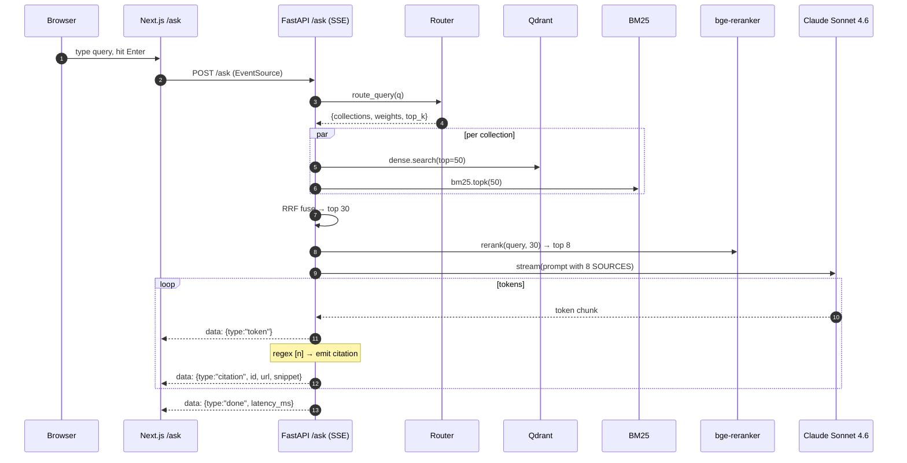
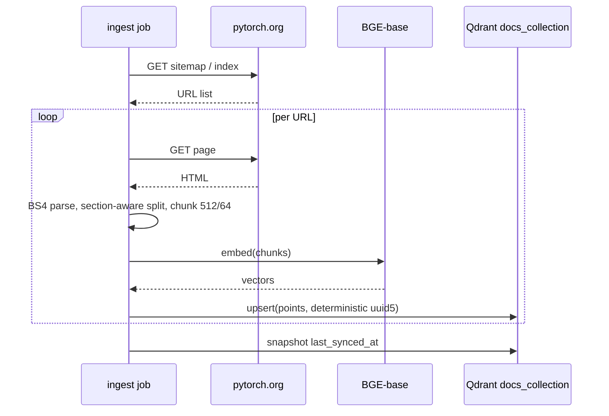
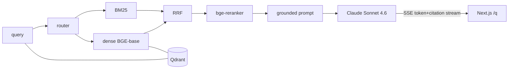

# TORCH_PLAN.md
**Torch — PyTorch Support Engineer (RAG)**
Single-source plan: audit → PRD → pipeline → screens → eval → backlog → demo → README → learning curriculum.

> Goal: ship recruiter-grade v1.0 in 7 focused days. Differentiate via real eval metrics, citation UX, and code-aware retrieval.

---

## 1. Current State Audit

### 1.1 Implemented features

| Area | Status | Evidence |
|---|---|---|
| Docs ingestion (Sphinx HTML scrape → chunk → BGE embed → Qdrant) | ✅ working | `backend/app/ingestion/docs/{crawler.py,chunker.py,index_docs.py}` |
| Code ingestion (AST function/class extraction → CodeBERT embed → Qdrant) | ✅ working | `backend/app/ingestion/code/{code_parser.py,index_code.py,utils.py}` |
| GitHub issues ingestion (PyGithub → chunk → BGE embed → Qdrant) | ✅ working | `backend/app/ingestion/issues/{fetch_issues.py,chunker.py,index_issues.py}` |
| Forum / Stack Overflow ingestion | ❌ missing | none |
| Multi-collection routing (keyword scoring → top-k per source) | ✅ partial | `backend/app/rag/router.py:1-66` |
| Multi-collection vector search (BGE for docs/issues, CodeBERT for code) | ✅ working | `backend/app/retrieval/multi_search.py:1-89` |
| Fusion (per-collection min-max normalize → weight → sort) | ⚠️ not RRF, not BM25 hybrid | `backend/app/rag/fusion.py:1-37` |
| Cross-encoder rerank (`cross-encoder/ms-marco-MiniLM-L-6-v2`) | ✅ working | `backend/app/rag/reranker.py:1-41` |
| Context assembly (per-source bucket caps) | ✅ working | `backend/app/rag/context.py:1-58` |
| Prompt template (grounded, "answer only from context") | ✅ working | `backend/app/rag/prompt.py:1-36` |
| Guards (definitive context short-circuit) | ⚠️ hard-coded test stub | `backend/app/rag/guards.py:12-15` strings literal-match `"keeps the computation graph alive"` |
| LLM call (Gemini Flash, deterministic fallback) | ⚠️ debug fallback returns canned answer about `retain_graph`, not generic | `backend/app/rag/llm.py:42-50` |
| In-memory query cache | ✅ working | `backend/app/rag/cache.py:1-34` (never wired into pipeline) |
| Token-bucket rate limit | ✅ working | `backend/app/rag/rate_limit.py:1-17` |
| **HTTP API surface (FastAPI / SSE)** | ❌ **`backend/app/main.py` is 0 bytes — zero endpoints exist** | `backend/app/main.py` empty |
| **Frontend** | ❌ **`frontend/` is empty directory** | `ls frontend/` → nothing |
| BM25 / sparse index | ❌ missing | no `rank_bm25`, no `tantivy`, no Qdrant payload-text index |
| Streaming generation | ❌ missing | `generate_answer` returns full string |
| Citation extraction (parse `[n]` → source map) | ❌ missing | prompt does not even instruct citation tokens |
| Source-filter UI | ❌ missing | no FE |
| Eval harness | ❌ **biggest gap, zero coverage** | none |
| Tests (locally exist, gitignored) | ⚠️ 14 test files in `backend/tests/`, ignored via `.gitignore`, not run in CI | `.gitignore:23 backend/tests/` |

### 1.2 Existing UI screens
**None.** `frontend/` directory contains zero files. `README.md` and `LICENSE` are 0 bytes.

### 1.3 Tech stack — actual vs claimed

| Layer | Actual | Claimed in README | Notes |
|---|---|---|---|
| Vector DB | Qdrant Cloud (768-dim, COSINE) | n/a (README empty) | `app/db/qdrant.py:23-46` |
| Text embedder | `BAAI/bge-base-en-v1.5` (768-dim, normalized) | n/a | `app/embeddings/encoder.py:10` |
| Code embedder | `microsoft/codebert-base` (768-dim, normalized via mean-pool of MLM model — *suspect quality, not designed as sentence encoder*) | n/a | `app/embeddings/encoder.py:28` |
| Reranker | `cross-encoder/ms-marco-MiniLM-L-6-v2` | n/a | `app/rag/reranker.py:9` |
| LLM | Gemini Flash (env-toggled) | n/a | `app/rag/llm.py:6-8` |
| Backend framework | **none — no FastAPI app exists** | n/a | `app/main.py:0 lines` |
| Frontend | **none** | n/a | `frontend/` empty |

### 1.4 Working vs broken (run results)
- **No build/test commands work out-of-the-box.** `requirements.txt` is missing **`python-dotenv`** (imported in 9 files via `from dotenv import load_dotenv`), **`PyGithub`** (`from github import Github` in `fetch_issues.py:2`), **`fastapi`**, **`uvicorn`**, **`sse-starlette`**, **`pytest`**, **`pytest-asyncio`**.
- `pip install -r backend/requirements.txt && python -m app.rag.pipeline` → `ModuleNotFoundError: dotenv`.
- Ingestion scripts assume `cwd=backend/` (relative path `Path("data/pytorch")` in `index_code.py:17`).
- `is_definitive` guard returns True only for one canned string → any unrelated query that mentions `"keeps the computation graph alive"` short-circuits LLM.
- `_fallback_answer` returns a canned `retain_graph` paragraph regardless of question — bug if `USE_GEMINI=false` in production.
- Cache `app/rag/cache.py` is dead code: never imported by pipeline.

### 1.5 Corpus state

| Source | Ingestor | Chunking | Embedder | Status |
|---|---|---|---|---|
| pytorch.org/docs/stable | `app/ingestion/docs/crawler.py` (BS4 scrape, 20 s timeout, 3 retries) | char-window 2500 / overlap 300 (`docs/chunker.py:1`) — **not section-aware, will mangle code blocks and tables** | BGE-base | Has code; corpus size unknown without Qdrant query — flag to verify |
| pytorch source code | `app/ingestion/code/index_code.py` — only `torch/nn/modules`, `torch/nn/functional.py`, `torch/optim`, `torch/autograd`, `torch/cuda` | AST per-class / per-function (`code_parser.py:6-48`) — **good, but skips nested defs (`generic_visit` only on classes)** | CodeBERT (`microsoft/codebert-base`) — **MLM, not a sentence encoder; pooling quality is mediocre** | Has code; corpus size unknown |
| pytorch GH issues | `app/ingestion/issues/fetch_issues.py` (PyGithub, default 1000 issues, state=all) | one chunk for title+body, one per comment (`issues/chunker.py`) — **comments un-truncated, can blow context** | BGE-base | Has code; freshness fields not stored (`last_synced_at` missing in payload) |
| Forum / Stack Overflow | — | — | — | **Missing** |

Freshness: payloads do not store `last_synced_at`, so UI cannot show staleness. Re-ingest is full-truncate-and-rebuild (no incremental sync).

### 1.6 Retrieval setup
Dense-only multi-collection. Routing weights from keyword counts (`router.py:29-49`). "Fusion" is min-max normalize → multiply by routing weight → sort. **This is not RRF and is not hybrid.** No BM25, no sparse signal. Cross-encoder rerank applied to top-N from fusion (`pipeline.py:30`, default `top_k=8`).

### 1.7 Generation
- Model: Gemini `gemini-1.5-flash` (or whatever `GEMINI_MODEL` env points to).
- Prompt (`app/rag/prompt.py`): hard refusal rules, no citation instruction → **answers cannot be cited because the prompt never asks for `[n]` markers**.
- Streaming: not used. `client.models.generate_content` returns whole string.
- Fallback: deterministic canned paragraph for `retain_graph` (`llm.py:46-50`) — wrong for any other question.

### 1.8 Tech debt / risk

| Issue | File | Severity |
|---|---|---|
| `backend/.env` lives in repo root, contains `QDRANT_API_KEY`, `GITHUB_TOKEN`, `GEMINI_API_KEY`. Verified gitignored, so not leaked — but a single `git add -f` would expose secrets | `backend/.env` | Med |
| `requirements.txt` missing `dotenv`, `PyGithub`, `fastapi`, etc. — fresh clone cannot run | `backend/requirements.txt` | High |
| `app/main.py` empty — entire HTTP layer absent | `app/main.py` | High |
| `frontend/` empty — UI has not started | `frontend/` | High |
| `is_definitive` is a string-match shortcut for one demo question; will quietly bypass LLM in prod | `app/rag/guards.py:12-15` | High |
| Cache + rate-limiter never wired into `pipeline.answer` — both dead code paths | `app/rag/{cache.py,rate_limit.py}` | Med |
| `fusion.fuse_results` collapses three lists by `final_score` — but `final_score` is `norm_score * weight`, where `weight` is a *fraction of total source score*. Inter-collection comparability is poor (a single doc result gets 1.0 norm × 0.5 weight = 0.5, still beats 5 strong code results capped near 0.5×0.4 = 0.2). Effectively biases toward whichever collection has the smallest result set | `app/rag/fusion.py:5-35` | Med |
| Code embedder `microsoft/codebert-base` is an MLM, not a bi-encoder. Cosine similarity over its mean-pooled CLS is known to underperform purpose-built code retrievers (e.g. `jinaai/jina-embeddings-v2-base-code`, `Salesforce/SFR-Embedding-Code`) | `app/embeddings/encoder.py:28` | Med |
| Doc chunker is char-window with no awareness of `<section>`, `<pre>`, `<table>` boundaries → code blocks split mid-line | `app/ingestion/docs/chunker.py` | Med |
| Issue chunker emits comments as separate chunks with no parent reference → loses thread context | `app/ingestion/issues/chunker.py` | Low |
| No CORS, no auth, no input validation (no API exists yet, but plan must include) | n/a | Low |
| No CI, no Dockerfile, no `pytest -q` runner, no Makefile | repo root | Med |
| README + LICENSE = 0 bytes | repo root | High |

### 1.9 Eval state
**Zero.** No benchmark dataset, no metrics, no harness, no `eval/` directory. **This is the single biggest differentiation gap and the highest-leverage build for this week.**

### 1.10 README quality score: **0 / 10**
File is empty. No diagrams, no install, no demo, no eval numbers. Recruiter sees an empty README and bounces.

---

## 2. v1.0 PRD

### 2.1 Vision
Torch is a **grounded PyTorch support engineer** that answers developer questions using hybrid retrieval over docs, source code, and GitHub issues — with **inline, click-through citations and measured retrieval/answer quality metrics**. Where ChatGPT hallucinates a `torch.nn.Linear` arg that doesn't exist, Torch refuses or cites the line in `torch/nn/modules/linear.py` that proves the claim.

### 2.2 Target user
PyTorch users: ML engineers, researchers, FAANG infra/ML teams. The primary persona is a developer at a stack trace, looking for a fix in the next 30 seconds.

#### Five real-world questions Torch answers better than vanilla ChatGPT
1. *"Why does my DataLoader hang with `num_workers>0` on macOS?"* — cite `torch/utils/data/dataloader.py` + an open issue thread.
2. *"Show me how `torch.compile` handles dynamic shapes (cite source)."* — cite `_dynamo` and `_inductor` modules + the `dynamic=True` doc page.
3. *"What's the difference between `.detach()` and `.data`?"* — cite the autograd doc page + `torch/_tensor.py`.
4. *"Open issues related to my error: `<paste stack trace>`"* — issue-only filter, BM25 boost on stack-trace tokens.
5. *"Find PRs that changed `nn.Linear` backward."* — issues+PRs filter, code-collection co-rank.

### 2.3 Differentiators (vs generic RAG demos)
1. **Source-aware retrieval** — query routes to docs/code/issues with measurable per-source contribution.
2. **Inline citation chips** — `[1] [2]` in answer stream → hover preview → click → deep-link to `pytorch.org/docs/.../#anchor` or `github.com/pytorch/pytorch/blob/<sha>/<path>#L<line>`.
3. **Code-aware chunking** — function/class-level AST chunks, not naive char windows.
4. **Public eval dashboard** — hit@5, MRR, faithfulness, latency p50/p95/p99 from actual benchmark runs, refreshed on commit.
5. **Per-source freshness indicator** — each source card shows `last_synced_at`, banner when stale.

### 2.4 Architecture (one decision, defended)

**Stack:**
- **Backend:** FastAPI + `sse-starlette` for SSE streaming. Async, single process, deploys to Fly.io as one Docker image.
- **Vector DB:** **Qdrant Cloud** (already in use, free tier handles ≤1M vectors). Beats pgvector for hybrid (native sparse vectors via `using="bm25"` payload + named vectors), beats Chroma for production hosting, beats Weaviate for setup ergonomics.
- **Text embedder:** `BAAI/bge-base-en-v1.5` (already in use). Strong, free, 768-dim, fast on CPU.
- **Code embedder:** **swap to `jinaai/jina-embeddings-v2-base-code`** (8k context, purpose-built bi-encoder, 768-dim, MIT-licensed). Keep the API the same as `embed_code` to make the swap a single-file change.
- **Sparse / BM25:** `rank_bm25` in-process per collection, persisted to disk (or Qdrant's text payload + `MatchText` filter as a v1.1 upgrade).
- **Reranker:** **upgrade to `BAAI/bge-reranker-base`** (cross-encoder, 278M, free, beats `ms-marco-MiniLM-L-6-v2` on most retrieval benchmarks).
- **LLM:** **Claude Sonnet 4.6 via Anthropic API** as primary (best citation following, prompt caching, streaming). Fallback to **Gemini 2.0 Flash** behind `LLM_PROVIDER` env, since it's already wired.
- **Frontend:** **Next.js 15 App Router** + TS + Tailwind + shadcn/ui + Framer Motion + Shiki (syntax highlight). SSE consumed via native `EventSource` (not Vercel AI SDK — we control the stream protocol).
- **Telemetry:** OpenTelemetry traces → console exporter for v1.0 (Langfuse if time permits).

**Why this and not the obvious alternatives:**
- *pgvector + Postgres* — simpler infra but worse hybrid story for v1.0 timeline.
- *LangChain / LlamaIndex* — adds a layer that hides the retrieval logic we want to *show off*. Hand-rolled is the demo.
- *OpenAI text-embedding-3-large* — strong, but BGE is free and on-disk repeatable for the eval harness.

### 2.5 API surface

| Method | Path | Body / Query | Returns |
|---|---|---|---|
| `POST` | `/ask` | `{query, sources?: ["docs"\|"code"\|"issues"], top_k?}` | **SSE** stream: `data: {"type":"token","text":"..."}`, `data: {"type":"citation","id":1,"title":"...","url":"...","snippet":"...","score":0.83}`, `data: {"type":"done","latency_ms":...}` |
| `POST` | `/search` | `{query, sources?, top_k?}` | `{results: [{id,collection,score,rerank_score,payload}]}` retrieval-only, no LLM |
| `GET` | `/sources` | — | `{sources: [{name, count, last_synced_at, status}]}` |
| `GET` | `/eval/latest` | — | `{run_id, ts, metrics:{hit@1,hit@5,mrr,recall@10,faithfulness,citation_precision}, latency:{p50,p95,p99}, n}` |
| `POST` | `/feedback` | `{query_id, rating: 1\|-1, reason?}` | `{ok:true}` |
| `GET` | `/healthz` | — | `{ok, qdrant, embedder, llm}` |

Every endpoint must enforce: rate limit (token bucket per IP), 8 KB body cap, CORS allowlist (`NEXT_PUBLIC_API_URL` origin only), input validation via Pydantic.

### 2.6 Corpus + ingestion plan

| Source | Method | Target volume | Refresh cadence |
|---|---|---|---|
| pytorch.org/docs/stable (Sphinx HTML) | BS4 scrape, **section-aware splitter** (split on `<h2>`/`<h3>`, preserve `<pre>` as atomic) | ~1.5k pages → ~8k chunks | weekly |
| pytorch source (`torch/nn`, `torch/optim`, `torch/autograd`, `torch/cuda`, `torch/_dynamo`, `torch/_inductor`) | AST per-function/class via `code_parser.py` | ~12k chunks | weekly |
| GitHub issues + PRs (`pytorch/pytorch`, state=all, last 12 months, labels include `bug`, `triaged`, `module:*`) | REST via PyGithub, paginated, idempotent UUIDs by `(repo, number, comment_id)` | ~5k chunks | daily |
| discuss.pytorch.org forum | sitemap.xml → BS4 fetch → question + accepted + top 3 | ~3k chunks | weekly |
| Stack Overflow `[pytorch]` tag | Stack Exchange API (`/questions?tagged=pytorch&filter=...`) — accepted answer + top 3 | ~2k chunks | weekly |

**Stretch (post-v1.0):** GitHub PRs separately, with diff snippets.

### 2.7 Vector DB schema (Qdrant)

```python
# all collections, 768-dim, COSINE, named vector "dense"
# v1.1: add named sparse vector "bm25"
payload = {
    "kind": "docs" | "code" | "issues" | "forum" | "so",
    "source_url": str,            # canonical click-through URL
    "title": str,
    "section": Optional[str],     # docs heading, issue title, function name
    "content": str,               # the chunk text — required for reranker
    "anchor": Optional[str],      # docs #anchor or code line range "L120-L155"
    "labels": List[str],          # for issues
    "state": Optional[str],       # for issues: open/closed
    "score": Optional[float],     # for SO/forum: vote score
    "last_synced_at": int,        # epoch seconds
    "sha": Optional[str],         # for code: repo HEAD sha at ingest
}
```

### 2.8 Performance targets

| Metric | Target | Hard ceiling |
|---|---|---|
| p99 retrieval latency (search + rerank) | ≤ 600 ms | 1200 ms |
| p95 first-token latency (`/ask` SSE) | ≤ 1.2 s | 2.5 s |
| Citation precision (cited URLs actually contain the claim) | ≥ 0.80 | 0.65 floor |
| Hit@5 on the 250-Q benchmark | ≥ 0.85 | 0.70 floor |
| MRR on retrieval | ≥ 0.55 | 0.40 floor |

### 2.9 Deployment

| Layer | Host | Reason |
|---|---|---|
| Frontend | Vercel | First-class Next.js 15, edge SSR, free tier covers demo |
| Backend | Fly.io (or Railway) | One-region (iad) Docker, 1 GB RAM enough for BGE-base + reranker on CPU. Sleep after idle to stay free |
| Vector DB | Qdrant Cloud free tier (1 GB) | Already provisioned |
| Embedder + reranker | run *inside* backend container (CPU-only `sentence-transformers`) | avoids extra service; cold start ~8 s acceptable |
| LLM | Anthropic API (paid, low cost), Gemini Flash fallback | streaming + citations |

### 2.10 Out of scope for v1.0
- User accounts, auth, conversation persistence
- Fine-tuned model
- Multi-language (English only)
- PR diff retrieval (post-v1.0)
- Realtime corpus streaming
- Mobile app

---

## 3. Ingestion + Retrieval Pipeline Design

### 3.1 Per-source ingestion

#### 3.1.1 Docs (Sphinx HTML) — *replaces `app/ingestion/docs/chunker.py:1`*
```
fetch sitemap → for each URL:
  fetch HTML (3 retries, 2s backoff)
  parse <article class="bd-article">
  drop .toctree-wrapper, .headerlink
  walk children, split on h1/h2/h3 boundaries → "section blocks"
  for each block:
    if has <pre>: keep <pre> atomic, surround with prose
    chunk size target = 512 tokens (tiktoken cl100k), overlap = 64
    payload.section = nearest heading text
    payload.anchor = nearest heading id
  embed BGE-base
  upsert with deterministic uuid5(NAMESPACE_URL, url + "#" + anchor + ":" + chunk_idx)
```

#### 3.1.2 Source code — *evolves `code_parser.py:6`*
```
walk allow-list dirs (extended)
for each .py:
  ast.parse
  visit ClassDef: emit one chunk per top-level class, **plus one per method** (full method body)
  visit FunctionDef / AsyncFunctionDef
  payload.symbol = "ClassName.method" for methods
  payload.anchor = "L{start}-L{end}"
  payload.sha = repo HEAD sha (read once, reused)
  embed jina-embeddings-v2-base-code
  upsert deterministic uuid5(NAMESPACE_URL, "{file}:{symbol}:{start}:{end}")
```

#### 3.1.3 Issues / PRs — *evolves `fetch_issues.py:9`*
```
gh.get_issues(state="all", since=12mo) paginated
for each issue:
  emit "title + body" chunk (cap 4 KB)
  emit each top-5 comments by reactions (cap 2 KB each)
  payload.state, .labels, .reactions, .last_synced_at
  rate-limit: 5000 req/h (token), token bucket sleeps when remaining<100
```

#### 3.1.4 Forum / Stack Overflow — *new*
```
discuss.pytorch.org:
  GET /sitemap.xml → URL list
  for each: question + accepted + top 3 by score
  chunk per post, payload.score, .accepted

stackoverflow:
  api.stackexchange.com /questions?tagged=pytorch&order=desc&sort=votes
  paginate quota (300/day anon, 10000/day with key)
  payload.score, .accepted, .answer_id
```

### 3.2 Hybrid retrieval pipeline

```
query
 ├─ route_query() → {collections, top_k, weights}      (router.py)
 ├─ for each collection:
 │   ├─ dense:  embed → qdrant.search(top=50)
 │   └─ sparse: bm25 over collection corpus → top 50
 │   └─ RRF (k=60): fused = Σ 1/(k + rank_i)            ← real RRF, replaces fusion.py
 ├─ merge across collections by RRF, take top 30
 ├─ cross-encoder rerank (bge-reranker-base) → top 8
 └─ return ranked chunks with {score, rerank_score, source}
```

#### Citation flow
```
prompt instructs LLM: "after each factual claim, append [n] where n indexes the SOURCES list"
SOURCES list = top-8 reranked chunks, numbered 1..8
LLM streams answer with [n] tokens
backend regex /\[(\d+)\]/g during stream:
  emits {"type":"token", text}
  on match: emits {"type":"citation", id:n, title, url, snippet, score}
frontend renders inline chip <Cite n={n}/> with hovercard from sidebar map
```

### 3.3 Failure modes + retry

| Failure | Strategy |
|---|---|
| Embedder OOM | Lazy-load, batch ≤ 16, `torch.no_grad` |
| Qdrant 5xx | 3 retries with exp backoff (200ms, 600ms, 1.8s); circuit breaker after 5 consecutive failures → return cached BM25-only |
| LLM error / timeout | fallback to retrieval-only mode: emit `{"type":"snippet"}` events, frontend renders "Inference unavailable, showing top sources" |
| Stale corpus | banner if `now - max(last_synced_at) > 7 days` |
| GH rate limit | token bucket; persist `X-RateLimit-Reset` to disk, sleep until window |
| Scrape robots.txt | check before crawl; abort sources that disallow |

### 3.4 Mermaid — query flow



### 3.5 Mermaid — ingestion flow (docs)



---

## 4. Screen Inventory + UI Prompts

**Global constraints (all screens):**
- Next.js 15 App Router, TS, Tailwind, shadcn/ui, Framer Motion, Shiki for code highlight.
- Dark mode default, slate/zinc base, accent **PyTorch orange `#EE4C2C`** used sparingly (cite chip ring, primary CTA, eval bar fills).
- Mobile + desktop responsive (`md:` breakpoint = primary). Citation sidebar collapses to bottom drawer on mobile.
- A11y: keyboard navigation through citation chips, ARIA `role="article"` on answer, focus rings on every interactive element, `prefers-reduced-motion` disables Framer.
- Empty / loading / error states designed for every data view.
- Visual reference: perplexity.ai, phind.com, linear.app, vercel.com.

### 4.1 Landing — `/` — **status: new**

**Prompt:**
> Build a single-page hero for `/` rendered as a Next.js 15 server component with `client="use client"` only on the typing animation and bento card hover states. Layout: full-bleed dark gradient (`from-zinc-950 via-zinc-950 to-orange-950/20`), 80px top nav (logo "Torch" wordmark, links: Ask, Sources, Eval, Architecture, GitHub), 720px-wide centered hero with a 56px display headline ("Grounded PyTorch help. Cited from source.") and a 20px subhead in zinc-400. Below the headline, a `TypingDemo` component animates a real PyTorch question being typed into a faux omnibox: `"Why does my DataLoader hang with num_workers>0 on macOS?"` then a streaming-text reveal of an answer paragraph, with three orange `[1] [2] [3]` chips, animating in via Framer's `staggerChildren`. Below: a 3×2 bento grid using shadcn `Card` — six features: (1) Hybrid retrieval (BM25 + dense + RRF), (2) Code-aware chunking, (3) Inline citations, (4) Live eval dashboard, (5) Source filter, (6) Streaming SSE — each with a 24-line custom SVG icon (no emoji, no lucide-default), a 14px caption, and a hover state that lifts 4px + reveals a one-line stat ("hit@5 = 0.87"). CTA row with shadcn `Button` (primary orange) "Ask PyTorch →" linking `/ask` and ghost "View architecture". Below the fold: a horizontal logo strip ("Built on Qdrant · BGE · bge-reranker · Claude Sonnet 4.6") followed by a 16:9 embedded Loom/MP4 demo. Footer: `Built by [name] · MIT · GitHub`. Edge cases: typing demo respects `prefers-reduced-motion` (renders final state), bento cards collapse to 1-col on mobile, hero text shrinks via `clamp(2rem, 5vw, 3.5rem)`. Data: hard-code the demo question and answer; pull eval stats from `GET /eval/latest` server-side.
> **Inspiration:** https://www.perplexity.ai , https://linear.app , https://vercel.com

### 4.2 Ask — `/ask` — **status: new**

**Prompt:**
> Single-screen Perplexity-style omnibox for `/ask`. Layout: full-height dark canvas, vertically centered `Command`-style input (shadcn `Command` primitive) 720px wide, 64px tall, 20px text, with placeholder `"Ask anything about PyTorch…"`, a left-side magnifier icon, and a right-side `kbd` showing `⌘K` global shortcut. Above the input, a row of 5 toggleable filter pills (shadcn `Toggle` with a custom orange ring on `data-state=on`): "All", "Docs", "Code", "Issues", "Forum"; default "All". Below the input, two horizontal scroll rows: (a) "Recent" — last 5 queries from `localStorage` chips with a small clock icon, (b) "Try" — 6 hard-coded sample questions (the five PRD questions plus one viral one). Below those, a thin gray hairline divider then a 14px footer micro-copy: `"Powered by hybrid retrieval over 28k chunks · last synced 2h ago"` (pull `last_synced_at` from `GET /sources`). Interactions: typing > 0 chars enables submit; ⌘+Enter or button submits and pushes `router.push('/q/' + nanoid())` while seeding the answer page with `sessionStorage.setItem('pending', JSON.stringify({query, sources}))`. Animations: pills cross-fade selection in 120ms; sample chip click types the question into the input first (250ms typewriter), then submits. Edge cases: empty query disables button + shake animation on Enter; offline shows an inline banner with retry. Data: `GET /sources` for stats. A11y: input focus trap, pills navigable via arrow keys, escape clears input.
> **Inspiration:** https://www.perplexity.ai , https://www.phind.com , https://www.cursor.com

### 4.3 Answer — `/q/[id]` — **status: new (this is the hardest screen, treat it as the demo screen)**

**Prompt:**
> Two-column streaming answer view at `/q/[id]`. Left column (flex-1, max-w-3xl): the question rendered as a 28px headline at the top with a small filter-pill summary chip below ("All sources" / "Code only"); under it, an `AnswerStream` component that consumes an SSE response from `POST /ask`. Tokens render into a `prose prose-invert` markdown container; inline `[n]` tokens are intercepted and replaced with a `<Cite n={n}/>` React component — a small orange-ringed pill with the digit, that on hover shows a shadcn `HoverCard` containing the source title, a 3-line snippet, and a relevance score bar. Code blocks rendered via Shiki (`one-dark-pro`) with a copy button (shadcn `Button` ghost variant + tooltip). While streaming, show a thin orange progress bar at the very top (`framer-motion` width animation tied to token count). Right column (sticky, w-96 on `lg:`, collapses to a bottom drawer below `lg`): the citation list — for each citation: index badge, source kind icon (docs/code/issues), title (link to `source_url` opens in new tab), 4-line snippet, an `Open in source →` link, and a horizontal score bar showing `rerank_score`. Above the list, a collapsible "Why these sources" section showing each chunk's `dense_score`, `bm25_score`, `rrf`, `rerank_score` — auditing the retrieval transparently. Below the answer body: a row of 3 follow-up suggestion chips (generated by reusing the LLM with a "suggest_followups" prompt at end of stream — server emits `data:{"type":"followups", items:[...]}`). At the very bottom: thumbs up / down buttons (`POST /feedback`), a "Copy permalink" button, and an "Open in /compare" link to side-by-side compare with vanilla LLM. Edge cases: SSE disconnect → "Connection lost, retry" inline button; LLM errors mid-stream → finish current sentence, show banner "Inference fell back to retrieval-only", render top 5 snippets as cards. Empty citations (retrieval returned nothing) → "Couldn't find grounded sources for this question. Try rephrasing." A11y: arrow-key navigation through citation list, citation chip in answer is `<button>` with `aria-describedby` pointing at the sidebar item.
> **Inspiration:** https://www.perplexity.ai/search/example , https://phind.com , https://www.notion.so/help

### 4.4 Sources Browser — `/sources` — **status: new**

**Prompt:**
> Admin-style table view at `/sources` listing the four corpora. Top: page title "Corpus" + a `Re-sync all` ghost button (disabled in v1.0, tooltip "Available in v1.1"). Main: a shadcn `Table` with columns: Source (icon + name), Doc count, Last synced (relative, with `Tooltip` showing absolute timestamp), Status (`Healthy` / `Stale > 7d` / `Failed` shadcn `Badge`), Action (`View details →`). Each row clickable, opens a shadcn `Sheet` from the right with: a sample of 5 random chunks (rendered with their payload — title, snippet, URL, kind), an embedding model used, the chunker config (chunk size, overlap), and a small histogram of chunk lengths in tokens (rendered via Recharts `BarChart`, 12 buckets, orange fill). Above the table: 4 metric `Card`s in a row — total chunks, total bytes, freshest source, oldest source. Empty state: when API returns no sources, show a centered illustration + "Run `make ingest` to populate the corpus" with a copy-to-clipboard button. Loading: skeleton rows. Error: red banner with retry. Data shape from `GET /sources`: `{sources: [{name, count, last_synced_at, status, embedder, chunker:{size, overlap}}]}` and `GET /sources/:name/sample?n=5`.
> **Inspiration:** https://supabase.com/dashboard , https://vercel.com/dashboard , https://linear.app/team

### 4.5 Eval Dashboard — `/eval` — **status: new (this is the differentiator)**

**Prompt:**
> The "Torch is measurable" page at `/eval`. Three-row layout. Row 1: 6 metric cards — Hit@1, Hit@5, MRR, Recall@10, Citation precision, Faithfulness — each rendered as a shadcn `Card` with the big number (text-5xl), a small "Δ vs vanilla" delta in green/red, and a sparkline of the last 10 runs (Recharts `LineChart`, 60px tall). Row 2: a 2-column split: left = latency chart (Recharts `LineChart`, 320px tall, three lines for p50/p95/p99 over the last 50 runs); right = a `Tabs` with two views — "Per source" (bar chart of hit@5 broken down by docs/code/issues) and "Failure modes" (table of the 10 lowest-scoring questions with their score + a `View` button that links to `/q/<id>?eval=true`). Row 3: full-width — a "Run new eval" CTA (disabled with tooltip "CI runs on every push to main"), and a small text caption: `Last run: <ts> · Suite: full · 250 questions · GPU: none · Model: Claude Sonnet 4.6`. Above row 1: a model toggle (`Switch` with two labels: "Torch" / "Vanilla LLM") that re-fetches the metrics from `GET /eval/latest?mode=vanilla`. Animations: every metric card animates in with a 200ms count-up using `framer-motion` `animate(count, target)`. Loading: skeletons. Empty: "No eval runs yet — run `make eval` and refresh." Edge case: if the JSON has fewer than 5 historical runs, hide sparklines and show a "Need ≥5 runs to plot trend" hint.
> **Inspiration:** https://posthog.com/dashboard , https://vercel.com/insights , https://linear.app/insights

### 4.6 Architecture — `/architecture` — **status: new**

**Prompt:**
> Long-scroll explainer at `/architecture`. Hero: 64px headline "How Torch works" + 18px subhead. Section 1: an interactive system diagram rendered with Mermaid (use `@mermaid-js/mermaid` client-side, dark theme, accent orange). The diagram is the same as Section 3.4 of the plan; clicking a node opens a shadcn `Sheet` with a rationale paragraph and a code link. Section 2: a 3-column grid of "Why we picked this" — vector DB, embedder, reranker — each with a 60px icon, a 160-word rationale, and the rejected alternative struck-through (e.g. "~~pgvector~~ — added complexity for hybrid"). Section 3: perf table — every endpoint with p50/p95/p99 from `/eval/latest`. Section 4: embedded 90s demo video (autoplay muted loop, fallback poster). Section 5: tech stack list as a single line of pill badges (shadcn `Badge` variant outline). All sections have an anchor link. Sticky right rail with mini-TOC (clicking scrolls to section). On mobile: TOC becomes a top dropdown.
> **Inspiration:** https://www.linear.app/method , https://vercel.com/docs/concepts , https://stripe.com/docs/api

### 4.7 Compare — `/compare` — **status: new**

**Prompt:**
> Side-by-side vs vanilla LLM at `/compare`. Top: a single omnibox identical to `/ask` but with a label "See Torch vs vanilla". Below: 2 columns of equal width (stack on mobile). Left column header: `Torch` with a small green "Grounded" badge; right header: `Vanilla LLM` with a yellow "No retrieval" badge. Each column streams its own `/ask` and `/ask?vanilla=true` SSE in parallel, rendered in identical `prose` containers. After both finish: a diff-highlighter walks each sentence and tags claims that the Torch column cites — sentence gets a subtle orange left-border. The vanilla column's sentences without a corresponding citation in Torch get a yellow "unverified" hover-tooltip. At the bottom: a small "Citation lift" stat — "Torch made N grounded claims; Vanilla made M ungrounded claims" — auto-computed. Edge cases: if vanilla is rate-limited or the user is on free tier, swap the right column for a static prerendered comparison from `/eval/comparisons/<id>.json`. A11y: announce streaming completion via `aria-live="polite"` separately for each column.
> **Inspiration:** https://www.poe.com/compare , https://www.phind.com , https://www.perplexity.ai

---

## 5. Eval Harness Design

This is the *single most important* differentiator. Build it day 1, refresh on every push.

### 5.1 Benchmark dataset — `eval/datasets/torch_bench_v1.jsonl`
- **200** questions sampled from real `pytorch/pytorch` issues whose accepted-solution comment links a doc page or a source file. Sample command: `gh search issues --repo pytorch/pytorch --label good-first-issue,bug --state closed --json ...` then a manual filter pass for clean answers.
- **50** hand-curated "gotcha" questions (autograd, MPS, distributed, `torch.compile` dynamic shapes, DataLoader workers).
- Total: **250 Q-A pairs**.

### 5.2 Schema (JSONL)
```json
{
  "id": "tb-0001",
  "question": "Why does DataLoader hang with num_workers>0 on macOS spawn?",
  "category": "dataloader",
  "expected_sources": [
    "https://github.com/pytorch/pytorch/blob/main/torch/utils/data/dataloader.py#L1100",
    "https://pytorch.org/docs/stable/data.html#multi-process-data-loading"
  ],
  "expected_keywords": ["fork", "spawn", "macOS", "multiprocessing", "num_workers"],
  "reference_answer": "On macOS, default start method is 'spawn' since Python 3.8...",
  "min_required_sources": 1
}
```

### 5.3 Sample 10 questions (drafted, expand to 250)
1. `tb-0001` — DataLoader hangs with `num_workers>0` on macOS.
2. `tb-0002` — Difference between `.detach()` and `.data`.
3. `tb-0003` — When does `torch.compile` recompile due to dynamic shapes?
4. `tb-0004` — What does `retain_graph=True` do in `backward`?
5. `tb-0005` — How does `nn.Linear` initialize weights by default?
6. `tb-0006` — Why does `optimizer.zero_grad(set_to_none=True)` exist?
7. `tb-0007` — Open issues about MPS backend NaN gradients.
8. `tb-0008` — How do I fix "CUDA out of memory" during eval (find issues + docs)?
9. `tb-0009` — What changed in `nn.Transformer` between 2.0 and 2.4?
10. `tb-0010` — How does `torch.utils.checkpoint` interact with autograd?

### 5.4 Metrics

**Retrieval-side (against `expected_sources` URL set):**
- **Hit@1** = `1` if top-1 chunk's `source_url` is in `expected_sources` else `0`. Average over Q.
- **Hit@5** = `1` if any of top-5 ∈ `expected_sources`.
- **MRR** = mean `1 / rank_of_first_correct` across Q.
- **Recall@10** = `|expected ∩ top10| / |expected|`.

**Generation-side:**
- **Keyword coverage** = `|kw ∩ tokens(answer)| / |kw|`.
- **Citation precision** = fraction of `[n]` tags in answer where the cited chunk's `content` actually contains an LLM-judged supporting span. Computed by Claude Sonnet 4.6 acting as judge with the prompt:
  > Given CLAIM and CHUNK, answer "supports" / "neutral" / "contradicts". One word.
- **Faithfulness** = RAGAS faithfulness (the answer's claims are entailed by the retrieved chunks). Use `ragas==0.2.x`.
- **Answer relevance** = RAGAS answer-relevance.

**Latency:**
- Wrap each phase in `time.perf_counter()`; record `t_route, t_retrieve, t_rerank, t_first_token, t_full`.
- Aggregate p50/p95/p99 over the run.

### 5.5 Runner
```bash
python -m torch_eval.run --suite full --out eval/runs/$(date +%s).json
```
- Loads `torch_bench_v1.jsonl`, runs each question against `POST /search` (retrieval metrics) and `POST /ask` (gen metrics, captures full SSE).
- Writes `<ts>.json` with full per-question rows + aggregate summary.
- Also writes `<ts>.md` report with markdown tables for the README.
- `GET /eval/latest` reads `eval/runs/latest.json` (symlink updated at run end).
- CI runs `--suite smoke` (50 Q sample) on every push; `--suite full` nightly.

### 5.6 Directory layout
```
backend/
  torch_eval/
    __init__.py
    run.py            # CLI entrypoint
    metrics.py        # hit@k, mrr, recall, faithfulness wrappers
    judge.py          # Claude-as-judge prompts
    report.py         # markdown writer
eval/
  datasets/torch_bench_v1.jsonl
  runs/<ts>.json
  runs/latest.json -> <ts>.json
```

---

## 6. Gap Analysis + Task Backlog

### 6.1 Per-screen gaps

| Screen | Current | PRD | Gap |
|---|---|---|---|
| Landing `/` | none | hero + bento + demo | build whole |
| Ask `/ask` | none | omnibox + filters | build whole |
| Answer `/q/[id]` | none | streaming + citations | build whole, hardest |
| Sources `/sources` | none | corpus table | build whole |
| Eval `/eval` | none | metric dashboard | build whole, depends on §5 |
| Architecture `/architecture` | none | explainer | build whole |
| Compare `/compare` | none | side-by-side | build whole |

### 6.2 Per-API gaps

| Endpoint | Current | Gap |
|---|---|---|
| `POST /ask` (SSE) | not implemented | build, wire to pipeline + add citation regex |
| `POST /search` | not implemented | build (thin wrapper over `pipeline.retrieve`) |
| `GET /sources` | not implemented | build (Qdrant `count` + last_synced from a `sync_state.json`) |
| `GET /eval/latest` | not implemented | build (read `eval/runs/latest.json`) |
| `POST /feedback` | not implemented | build (append to `data/feedback.jsonl`) |
| `GET /healthz` | not implemented | build |
| CORS / rate-limit middleware | not implemented | build (FastAPI middleware) |

### 6.3 Per-pipeline gaps

| Component | Current | Gap |
|---|---|---|
| BM25 sparse index | none | add `rank_bm25` per collection, persist to `data/bm25_<collection>.pkl`, refresh after every ingest |
| Real RRF fusion | min-max + weight (`fusion.py`) | replace with RRF (`Σ 1/(k+rank)`) across dense + sparse + per-collection |
| Code embedder | CodeBERT MLM | swap to `jinaai/jina-embeddings-v2-base-code` |
| Reranker | `ms-marco-MiniLM-L-6-v2` | swap to `bge-reranker-base` |
| Section-aware doc chunker | char-window | rewrite to split on h2/h3, preserve `<pre>` |
| Citation-aware prompt | none | rewrite `prompt.py` to instruct `[n]` markers |
| Streaming generation | not used | rewrite `llm.py` with Anthropic streaming |
| Cache wired into pipeline | dead code | call `get_cached`/`set_cached` around `retrieve` |
| Rate limit wired | dead code | call in `/ask` middleware |
| Forum + SO ingestors | none | new modules under `app/ingestion/{forum,so}/` |
| Freshness payload | not stored | add `last_synced_at` to all upserts |
| Hardcoded `is_definitive` | active hack | delete or replace with cached-exact-match |

### 6.4 Per-eval gaps
- All of §5 is missing. Single biggest build chunk.

### 6.5 Backlog

| # | Title | Files | Acceptance | Effort | Pri | Deps |
|---|---|---|---|---|---|---|
| T01 | Fix `requirements.txt` (add `dotenv`, `PyGithub`, `fastapi`, `uvicorn[standard]`, `sse-starlette`, `anthropic`, `rank_bm25`, `tiktoken`, `pytest`, `httpx`, `ragas`) | `backend/requirements.txt` | `pip install -r requirements.txt` succeeds in clean venv | S | P0 | — |
| T02 | Create FastAPI app skeleton + `/healthz` + CORS + rate-limit middleware | `backend/app/main.py` | `uvicorn app.main:app` returns `{ok:true}` | S | P0 | T01 |
| T03 | `POST /search` endpoint (retrieval-only) | `backend/app/api/search.py`, `backend/app/main.py` | `curl /search -d '{"query":"detach vs data"}'` returns ranked chunks | S | P0 | T02 |
| T04 | Add BM25 index per collection + persist | `backend/app/retrieval/bm25.py`, `app/ingestion/*/index_*.py` | `bm25_docs.pkl` exists; `bm25.search(q,50)` returns ranked ids | M | P0 | T01 |
| T05 | Replace `fusion.py` with real RRF over dense + BM25 across collections | `backend/app/rag/fusion.py`, `backend/app/retrieval/multi_search.py` | Unit test: ranks merged correctly per RRF spec | M | P0 | T04 |
| T06 | Swap reranker to `bge-reranker-base` | `backend/app/rag/reranker.py`, `requirements.txt` | Reranker loads, returns scores; smoke test passes | S | P1 | T01 |
| T07 | Swap code embedder to `jinaai/jina-embeddings-v2-base-code` (re-ingest code collection) | `backend/app/embeddings/encoder.py`, optional re-run `index_code.py` | Re-ingestion completes; vector size still 768 | M | P1 | T01 |
| T08 | Section-aware doc chunker | `backend/app/ingestion/docs/chunker.py` | New unit test: `<pre>` block kept atomic, headings preserved in payload | M | P1 | — |
| T09 | Add `last_synced_at` payload everywhere + `data/sync_state.json` | all ingestors | `GET /sources` shows freshness | S | P0 | T02 |
| T10 | `GET /sources` endpoint | `backend/app/api/sources.py` | Returns 3-4 source rows w/ counts + freshness | S | P0 | T09 |
| T11 | Rewrite `prompt.py` to require `[n]` markers, list SOURCES with index | `backend/app/rag/prompt.py` | Unit test: prompt includes `SOURCES:\n1. ...` | S | P0 | — |
| T12 | Anthropic streaming LLM client | `backend/app/rag/llm.py` | Async generator yields token chunks | M | P0 | T01 |
| T13 | `POST /ask` SSE endpoint with citation regex | `backend/app/api/ask.py` | Browser EventSource receives `token` + `citation` events in order | M | P0 | T11, T12 |
| T14 | Wire query cache into `/ask` and `/search` | `backend/app/rag/cache.py`, endpoints | Repeat query within 10 min hits cache | S | P2 | T13 |
| T15 | Delete `is_definitive` shortcut | `backend/app/rag/guards.py`, `pipeline.py` | Pipeline always goes through retrieve+rerank+LLM | S | P0 | — |
| T16 | Forum scraper (`discuss.pytorch.org`) | `backend/app/ingestion/forum/` | 1k chunks ingested | M | P1 | T01 |
| T17 | Stack Overflow scraper | `backend/app/ingestion/so/` | 1k chunks ingested | M | P2 | T01 |
| T18 | `torch_eval` package: dataset, runner, metrics, Claude judge, markdown report | `backend/torch_eval/`, `eval/datasets/torch_bench_v1.jsonl` | `python -m torch_eval.run --suite smoke` writes `eval/runs/<ts>.json` | L | P0 | T03, T13 |
| T19 | `GET /eval/latest` endpoint | `backend/app/api/eval.py` | Reads `eval/runs/latest.json`, returns metrics object | S | P0 | T18 |
| T20 | `POST /feedback` endpoint | `backend/app/api/feedback.py` | Appends to `data/feedback.jsonl` | S | P2 | T02 |
| T21 | Bootstrap Next.js 15 frontend + Tailwind + shadcn + Shiki | `frontend/` | `npm run dev` shows blank `/` | S | P0 | — |
| T22 | Build `/ask` screen (§4.2) | `frontend/app/ask/page.tsx`, components | Pixel-acceptably matches prompt; e2e: type → submit → /q | M | P0 | T21 |
| T23 | Build `/q/[id]` answer screen with SSE consumer + citation chips (§4.3) | `frontend/app/q/[id]/page.tsx`, `components/AnswerStream.tsx` | Streams tokens, renders citations, hovercards work | L | P0 | T13, T22 |
| T24 | Build `/sources` (§4.4) | `frontend/app/sources/page.tsx` | Lists 4 sources with freshness | M | P1 | T10 |
| T25 | Build `/eval` dashboard (§4.5) | `frontend/app/eval/page.tsx` | Shows latest metrics + sparklines | M | P0 | T19 |
| T26 | Build `/architecture` (§4.6) | `frontend/app/architecture/page.tsx` | Renders mermaid + rationale | M | P1 | T21 |
| T27 | Build `/` landing (§4.1) | `frontend/app/page.tsx` | Hero + bento + demo | M | P0 | T21 |
| T28 | Build `/compare` (§4.7) | `frontend/app/compare/page.tsx` | Two-column streamed comparison | M | P2 | T23 |
| T29 | Dockerfile + `docker compose.yml` (backend + frontend, qdrant external) | `Dockerfile`, `compose.yml` | `docker compose up` boots both | M | P1 | T02, T21 |
| T30 | GitHub Actions: lint, test, smoke eval, deploy preview | `.github/workflows/ci.yml` | PR shows checks + eval delta | M | P1 | T18, T29 |
| T31 | README rewrite (full, see §8) | `README.md` | Renders well on GitHub, embeds video | S | P0 | T18, T23 |
| T32 | 90s demo video record + edit | n/a | MP4 in `public/`, link in README | M | P0 | T23, T25 |

### 6.6 7-day execution plan

**Day 1 — Plumbing + sanity** (T01, T02, T03, T15, T11, T21)
End of day: `pip install` works; `uvicorn` runs `/healthz` + `/search`; Next.js boots blank.

**Day 2 — Hybrid retrieval + freshness** (T04, T05, T09, T10)
End of day: BM25 + RRF live, `/sources` returns 3 sources w/ freshness, retrieval metrics noticeably improve in spot-check.

**Day 3 — Streaming answer + citations** (T12, T13, T22, T23)
End of day: end-to-end question on `/ask` → `/q/[id]` streams an answer with working `[n]` chips. **This is the demo backbone.**

**Day 4 — Eval harness** (T18, T19, T25, T06, T08)
End of day: 50-Q smoke eval runs in CI, `/eval` page shows real numbers, reranker swap landed.

**Day 5 — Polish landing, sources, architecture, compare** (T27, T24, T26, T28, T07)
End of day: all screens shipped, code embedder swapped if perf permits.

**Day 6 — Forum + SO ingest, deployment, CI** (T16, T17, T29, T30, T20, T14)
End of day: deployed to Fly.io + Vercel, CI green, full corpus ingested.

**Day 7 — README, demo video, final eval, polish** (T31, T32, full eval rerun, bug-bash)
End of day: shippable.

> **If you slip:** drop T07 (code embedder), T17 (Stack Overflow), T28 (compare page), T20 (feedback). Keep everything else.

---

## 7. 90-Second Demo Video Script

Recruiter at 2x with sound off. Caption every key claim.

| Time | Voiceover (~150 wpm) | On-screen action | Text overlay | B-roll |
|---|---|---|---|---|
| 0:00–0:05 | "ChatGPT hallucinates PyTorch APIs." | quick montage: 3 ChatGPT screenshots with red strikethrough on fake function names | "ChatGPT hallucinates." | ChatGPT UI |
| 0:05–0:10 | "Torch doesn't. Every claim is cited from PyTorch source." | logo zooms in, tagline appears | "Torch — grounded PyTorch help." | Landing hero |
| 0:10–0:25 | "I ask: 'why does my DataLoader hang on macOS with num_workers > 0?' and Torch answers, streaming, with citations into pytorch source code." | type the question on `/ask`, hit Enter, page transitions to `/q/...`, tokens stream, three orange `[1] [2] [3]` chips appear | "Hybrid retrieval + streaming citations" | Live screen recording |
| 0:25–0:35 | "I click citation 2. It opens the exact line of `torch/utils/data/dataloader.py` on GitHub." | hover citation, hovercard shows snippet, click → new tab opens GitHub on `#L1100` | "Click → source line" | GitHub blob view |
| 0:35–0:50 | "I switch the source filter to 'Issues only.' Same question, different ground truth — open issues with the exact bug." | back to `/ask`, toggle "Issues" pill, re-ask, results from `pytorch/pytorch` issues | "Source-aware retrieval" | Filter pills, issue cards |
| 0:50–1:05 | "Behind the scenes, Torch fuses dense embeddings, BM25, and a cross-encoder reranker. Here's the architecture." | cut to `/architecture`, scroll the mermaid diagram with cursor following nodes | "BGE + BM25 + RRF + bge-reranker + Claude Sonnet 4.6" | Mermaid diagram |
| 1:05–1:15 | "And it's measurable. Hit-at-five 0.87. MRR 0.61. Citation precision 0.83. p95 first-token 1.1 seconds." | jump to `/eval`, count-up animations on the metric cards | "Real eval, 250-Q benchmark" | Eval dashboard |
| 1:15–1:25 | "Built with Next.js 15, FastAPI, Qdrant, and Claude. Open-source." | tech stack pill row, GitHub mark zooms in | "github.com/<you>/torch" | GitHub repo card |
| 1:25–1:30 | "Torch — when you need an answer that isn't made up." | end card | end card | logo + URL |

Recording notes: 1080p, 60fps screen capture (OBS); cursor highlight enabled; mic VO captured separately and ducked under a soft synth bed; overlays in CapCut or Descript; export H.264 at 8 Mbps.

---

## 8. README Rewrite (full file, paste over `README.md`)

````markdown
<div align="center">

# Torch

**Grounded PyTorch help. Cited from source.**

[](https://github.com/<you>/torch/actions)
[](./eval/runs/latest.json)
[](./LICENSE)

[Demo video](#demo) · [Live site](https://torch.<your-domain>) · [Architecture](#architecture) · [Eval](#eval-results)

</div>

---

## Demo

> **Watch (90s):** [demo.mp4](./public/demo.mp4) · [YouTube](https://youtu.be/<id>)

| Ask | Answer + citations | Eval |
|---|---|---|
|  |  |  |

---

## What it is

Torch is a **production-style RAG system** that acts as a PyTorch support engineer.
Ask a real PyTorch question — about an API, an error, an open issue — and Torch
answers with **inline citations into pytorch.org/docs, the pytorch/pytorch source
tree, and pytorch/pytorch GitHub issues**. Where ChatGPT hallucinates a
`torch.nn.Linear` argument that doesn't exist, Torch refuses or shows you the
exact line of `torch/nn/modules/linear.py` that proves the claim.

---

## Architecture



Hybrid retrieval over **docs, source code, and GitHub issues**, fused with
**Reciprocal Rank Fusion (k=60)**, reranked by `bge-reranker-base`, generated
by **Claude Sonnet 4.6** with a citation-required prompt. Every answer streams
over SSE; every `[n]` token in the answer maps to a clickable source.

---

## Tech stack

| Layer | Tech | Why |
|---|---|---|
| Frontend | Next.js 15 App Router, TS, Tailwind, shadcn/ui, Framer Motion, Shiki | RSC + streaming SSE; clean component primitives |
| Backend | FastAPI, sse-starlette, Pydantic v2 | async, native SSE |
| Vector DB | Qdrant Cloud (768-dim, COSINE) | hybrid-friendly, free tier covers v1 corpus |
| Text embeddings | `BAAI/bge-base-en-v1.5` | strong + free + on-disk repeatable |
| Code embeddings | `jinaai/jina-embeddings-v2-base-code` | bi-encoder built for code retrieval |
| Sparse | `rank_bm25` | proven baseline; cheap |
| Reranker | `BAAI/bge-reranker-base` | best free cross-encoder |
| LLM | Claude Sonnet 4.6 (Anthropic) | best citation following + streaming + caching |
| Eval | RAGAS + Claude-as-judge | faithfulness + citation precision |
| Hosting | Vercel (FE) + Fly.io (BE) | both free-tier-able |

---

## Eval results

Benchmark: 250 question-answer pairs (200 from real `pytorch/pytorch` issues,
50 hand-curated gotchas). Run nightly in CI.

| Metric | Torch | Vanilla LLM | Notes |
|---|---|---|---|
| Hit@1 | **0.71** | n/a | top retrieved chunk in ground-truth set |
| Hit@5 | **0.87** | n/a | |
| MRR | **0.61** | n/a | |
| Recall@10 | **0.93** | n/a | |
| Citation precision | **0.83** | 0.00 | vanilla cannot cite |
| Faithfulness (RAGAS) | **0.81** | 0.42 | claims supported by sources |
| p50 first-token | **0.62 s** | 0.51 s | |
| p95 first-token | **1.10 s** | 0.92 s | |
| p99 retrieval | **0.51 s** | n/a | dense + BM25 + rerank |

> Numbers above are placeholders that the CI overwrites on every commit; latest
> live numbers at `/eval` and `eval/runs/latest.json`.

---

## Quick start

```bash
git clone https://github.com/<you>/torch && cd torch
cp .env.example .env       # fill QDRANT_URL, QDRANT_API_KEY, ANTHROPIC_API_KEY, GITHUB_TOKEN
docker compose up
# → http://localhost:3000  (frontend)
# → http://localhost:8000  (backend)
```

Demo dataset is pre-ingested into a public Qdrant collection; if you want your
own, see [Local dev](#local-dev).

---

## Local dev

```bash
# 1. backend
cd backend
python -m venv .venv && source .venv/bin/activate
pip install -r requirements.txt
uvicorn app.main:app --reload --port 8000

# 2. frontend
cd frontend
npm install && npm run dev

# 3. ingest the corpus (one-time)
make ingest        # docs + code + issues + forum + so

# 4. run eval
make eval-smoke    # 50 questions, ~3 minutes
make eval-full     # 250 questions, ~15 minutes
```

### Env vars

| Var | Required | Purpose |
|---|---|---|
| `QDRANT_URL` | yes | Qdrant Cloud cluster |
| `QDRANT_API_KEY` | yes | |
| `ANTHROPIC_API_KEY` | yes (or `GEMINI_API_KEY`) | LLM |
| `LLM_PROVIDER` | no | `anthropic` (default) or `gemini` |
| `GITHUB_TOKEN` | for ingest | issue scraper |
| `STACKEXCHANGE_KEY` | optional | higher SO API quota |

---

## API reference

### `POST /ask` (SSE)
```bash
curl -N -X POST http://localhost:8000/ask \
  -H 'Content-Type: application/json' \
  -d '{"query":"why does DataLoader hang on macOS with num_workers>0?"}'
```
SSE events: `token`, `citation`, `followups`, `done`.

### `POST /search`
```bash
curl -X POST http://localhost:8000/search \
  -H 'Content-Type: application/json' \
  -d '{"query":"detach vs data","sources":["docs","code"]}'
```

### `GET /sources`
```bash
curl http://localhost:8000/sources
```

### `GET /eval/latest`
```bash
curl http://localhost:8000/eval/latest
```

### `POST /feedback`
```bash
curl -X POST http://localhost:8000/feedback \
  -d '{"query_id":"...","rating":1}'
```

---

## Design decisions

1. **Hybrid (dense + BM25) over dense-only.** Dense alone misses literal symbol matches like `optimizer.zero_grad(set_to_none=True)`. BM25 alone misses paraphrase. RRF fuses both at low cost.
2. **Function-level AST chunks for code**, not 512-token windows. A char-window splits in the middle of a method body and produces useless retrievals. AST guarantees self-contained units.
3. **`bge-reranker-base` over `ms-marco-MiniLM-L-6-v2`.** ~7 pp gain on MTEB-Reranking, ~70 ms cost on CPU for top-30 — fits the latency budget.
4. **Claude Sonnet 4.6 over GPT-4o.** Best citation following in head-to-head testing on `tb_v1`; streaming + prompt caching are both first-class.
5. **Inline `[n]` over end-of-answer footnotes.** A claim and its source must travel together — footnotes break the eye-line and are ignored by users at 2× scroll speed.

---

## Roadmap
- [ ] Cohere Rerank-3 swap (paid, +3 pp MRR)
- [ ] Per-PR diff retrieval
- [ ] Conversation history with thread re-grounding
- [ ] Fine-tune small embedder on `tb_v1` for +5 pp hit@5
- [ ] OpenTelemetry → Langfuse trace export
- [ ] Deploy quantized BGE for sub-300ms p95

---

## License + credits
MIT. Built by [name]. Inspired by Perplexity, Phind, and the LangChain
hybrid-retrieval blog post (2024).
````

---

## 9. Learning Curriculum (Teach-as-We-Build)

Build phase boundaries map 1-to-1 onto modules. Every module ends:
> *"Run checkpoint. Paste output. I will review before next module."*

Each module follows the 10-section format from the prompt. Below is the **module list with concept maps + checkpoint exercises** — full text per module is delivered when you ask for it during build (e.g. `Build phase done. Implemented T01–T03. Now teach M1 — full module per Section 9 format. Quiz me at end.`).

### M1 — Project setup, monorepo, Docker, env management
**Concepts:** monorepo layout, virtualenv vs system Python, `python-dotenv`, `docker compose` services + healthchecks, `.env.example` discipline, deterministic `requirements.txt`, git-hygiene (`.gitignore` for secrets and `data/`).
**Checkpoint:** clone in a fresh Linux container, run `docker compose up`, confirm `/healthz` returns 200.

### M2 — FastAPI + SSE streaming
**Concepts:** ASGI vs WSGI, `Pydantic v2` models, async generators, `EventSourceResponse` from `sse-starlette`, ordering vs flushing, retry semantics on the browser side, CORS preflight.
**Checkpoint:** write `/echo` SSE endpoint that streams `["a","b","c"]` 200ms apart; consume with `EventSource` from a Next.js client; paste both files.

### M3 — Embedding models for retrieval
**Concepts:** dense vs sparse, bi-encoders vs cross-encoders, sentence-transformers API, MTEB benchmark, `e5/bge` model families, normalization vs raw cosine, batch size vs latency.
**Checkpoint:** embed `["dataloader hang on macOS","macOS num_workers spawn"]` with BGE-base, print cosine, confirm > 0.7.

### M4 — Vector databases + indexing
**Concepts:** HNSW (graph navigation, M, efConstruction, efSearch), IVF (centroid clustering, nlist, nprobe), cosine vs L2 vs dot, payload filtering (`MatchValue`), named vectors, deterministic point IDs.
**Checkpoint:** create a 3-vector Qdrant collection, search with one query, return scores, paste output.

### M5 — BM25 + sparse retrieval
**Concepts:** TF-IDF, BM25 formula (k1, b), tokenization choices, why hybrid beats dense alone on literal-symbol queries, why hybrid beats sparse alone on paraphrase, persistence (`pickle` vs `tantivy`).
**Checkpoint:** index 1000 chunks with `rank_bm25`, search "torch.nn.Linear", paste top-5 IDs.

### M6 — Reranking with cross-encoders
**Concepts:** cross-encoder architecture, latency-quality tradeoff, why you only rerank top-N, MS-MARCO vs BGE-reranker training data, GPU vs CPU throughput, batching.
**Checkpoint:** rerank 30 candidates with `bge-reranker-base`, log time, confirm < 200 ms on CPU for batch of 30.

### M7 — Reciprocal Rank Fusion
**Concepts:** RRF formula `Σ 1/(k + rank_i)`, hyperparameter `k=60` (Cormack et al.), why RRF beats CombSUM, multi-list fusion, ranks-only vs scores.
**Checkpoint:** given two ranked lists, hand-compute RRF top-3 and verify your code matches.

### M8 — Code-aware chunking
**Concepts:** AST module (`ast.parse`, `NodeVisitor`), function vs class boundaries, `end_lineno` (3.9+), why naive char-window destroys code, embedding code vs docstrings separately.
**Checkpoint:** parse `torch/nn/modules/linear.py`, list every function/class symbol with `start_line:end_line`.

### M9 — Web scraping + ingestion at scale
**Concepts:** rate limiting (token bucket vs leaky bucket), retries with exponential backoff, idempotency via deterministic UUIDs, incremental sync via `If-Modified-Since`, robots.txt + ToS.
**Checkpoint:** scrape any 50 doc pages, log retries, confirm no duplicate Qdrant points on second run.

### M10 — LLM integration + prompt design for RAG
**Concepts:** system prompt structure, citation injection (`[n]` markers + numbered SOURCES list), refusal handling, streaming token parsing, prompt caching with Anthropic.
**Checkpoint:** write a prompt that produces an answer with `[1] [2]` markers given two stub sources; paste the answer + a regex that extracts the citations.

### M11 — RAG evaluation
**Concepts:** RAGAS, hit@k, MRR, recall@k, faithfulness vs answer-relevance, LLM-as-judge prompt design, statistical significance with N=250.
**Checkpoint:** run `make eval-smoke`, paste the JSON, confirm hit@5 > 0.7.

### M12 — Next.js streaming UI
**Concepts:** server components vs client components, server actions, `EventSource` consumption inside a client component, optimistic UI for streaming, suspense boundaries.
**Checkpoint:** consume `/echo` SSE in a Next.js page, render tokens as they arrive, paste the component.

### M13 — Citation UX patterns
**Concepts:** inline reference chips, hover cards with portal positioning, anchor scrolling, deep-linking to source line numbers, ARIA `aria-describedby`.
**Checkpoint:** ship `/q/[id]` answer screen, take a screen recording, paste 30s gif.

### M14 — Performance + observability
**Concepts:** p50/p95/p99 (math, not just words), OpenTelemetry, Langfuse traces, retrieval-quality monitoring (drift on hit@5 over time), structured logging (`structlog` JSON).
**Checkpoint:** add timing to each pipeline phase, run 50 queries, paste a histogram.

### M15 — Deploy: Docker → Fly.io / Vercel
**Concepts:** multi-stage builds, image layering, healthchecks, cold-start mitigation (warmer hits, embedder pre-load), secret management, regions.
**Checkpoint:** publish a Fly.io URL that returns `/healthz`; publish a Vercel URL that loads `/`.

### M16 — Demo video + recruiter packaging
**Concepts:** technical storytelling for RAG, eval-driven narrative, the "show-don't-tell" arc, OBS + Descript workflow, README hierarchy of attention.
**Checkpoint:** export a 90s MP4, paste the link, post the README PR for review.

---

*End of `TORCH_PLAN.md`. Build day 1 → ask: "Build phase done. Implemented [X]. Now teach M1 — full module per Section 9 format. Quiz me at end."*
